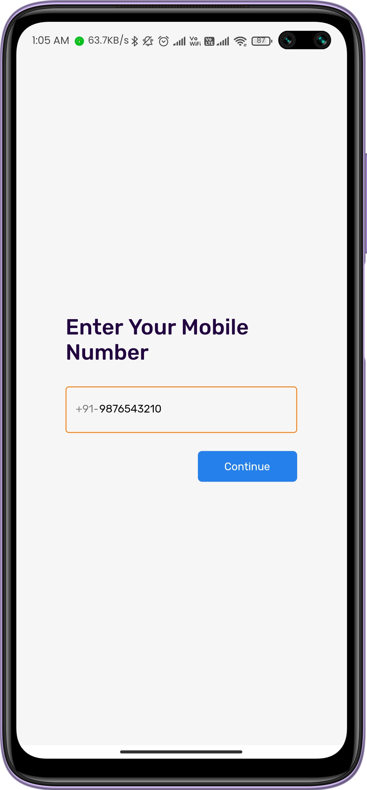
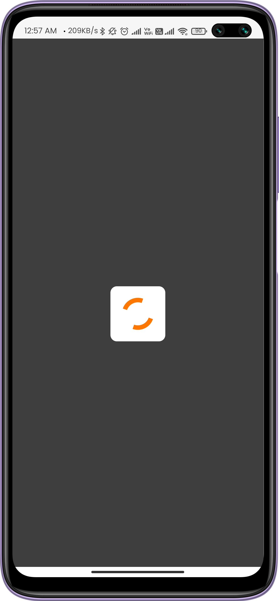
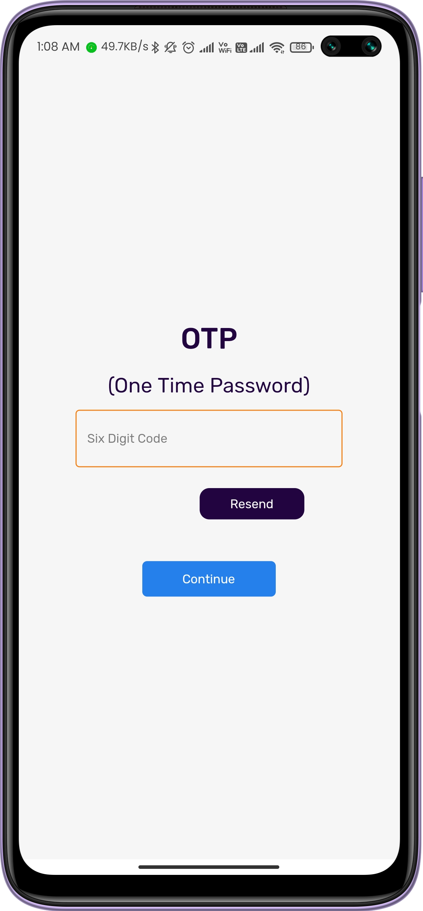
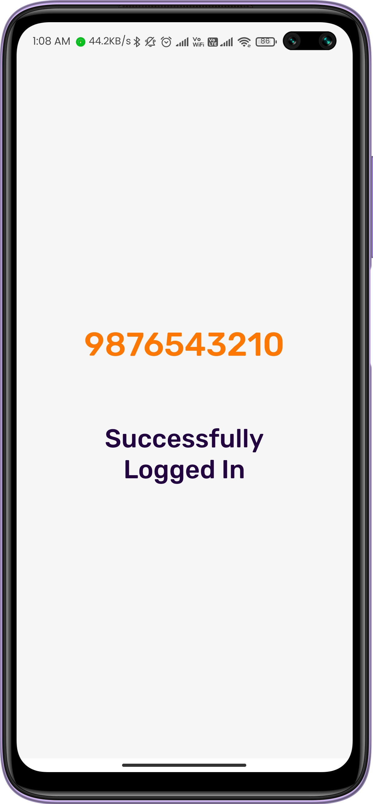
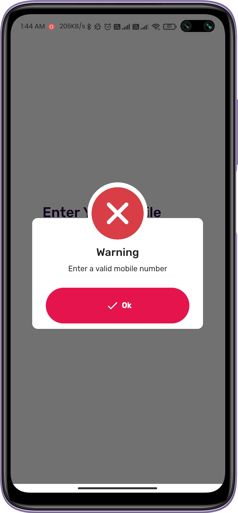

# Mobile-OTP Authentication 

A Flutter based Mobile Number Authentication with OTP (One Time Password), used to verify user mobile number with the code sent on the enter mobile number with Firebase Authentication and Get library.

## Packages Used
- [x] [firebase_auth](https://pub.dev/packages/firebase_auth)
- [x] [firebase_core](https://pub.dev/packages/firebase_core)
- [x] [get](https://pub.dev/packages/get)
- [x] [google_fonts](https://pub.dev/packages/google_fonts)
- [x] [flutter_spinkit](https://pub.dev/packages/flutter_spinkit)
- [x] [awesome_dialog](https://pub.dev/packages/awesome_dialog)

## ScreenShots

          

 
 

          

 
 
 ## Getting Started
 

This project is a starting point for a Flutter application.

A few resources to get you started if this is your first Flutter project:

- [Lab: Write your first Flutter app](https://flutter.dev/docs/get-started/codelab)
- [Cookbook: Useful Flutter samples](https://flutter.dev/docs/cookbook)

For help getting started with Flutter, view our
[online documentation](https://flutter.dev/docs), which offers tutorials,
samples, guidance on mobile development, and a full API reference.
